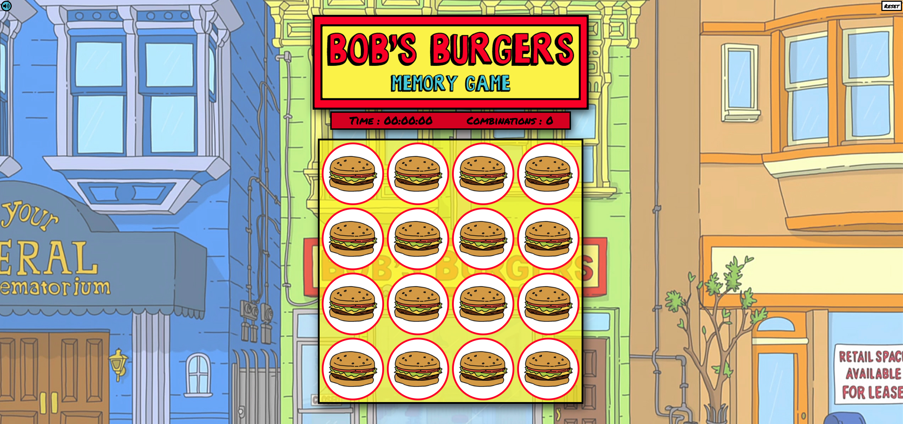
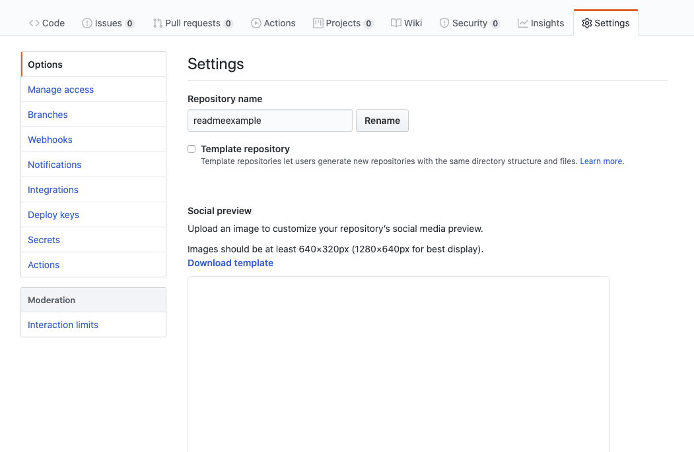
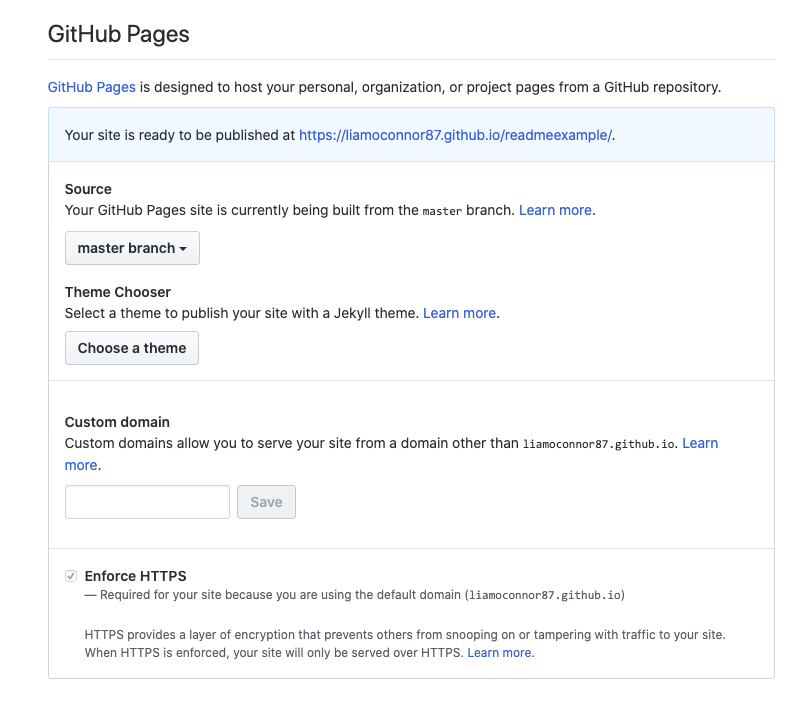

Bob's Burgers Memory Game Project
==========================

**Website** - [Bob's Burgers Memory Game](https://liamoconnor87.github.io/bobsburgersgame/)

The Bob's Burgers Memory Game is at it's core a simple memory card game, designed in the style of a popular Animated TV Show, Bob's Burgers.

Although the game would appeal more to fan of the tv show, the style, animation and colour scheme are easy on the eyes and will appeal to a larger audience. Added comical sounds captured directly from the show create an amusing experience for both fans and non-fans of the show - it's fun for all!

UX
==

Each level has an animated loading screen of a pulsating buger fading in and out of visability, giving the game adequate time to load in the background but also giving a typical experience for a seasoned gamer.

The game consists of three levels, increasing in difficulty as the User progresses.

>Level One - Game board consists of a 4x4 card set.

>Level Two - Game board consists of 5x5 card set.

>Level Three - Game board consists of a 6x6 card set. 

The User, will be able to play the game to the backdrop of the Bob's Burgers sound track as well as delightful short sounds that indicate when a card is flipped, matched or the game has completed. Each level's card flip sound is different, to keep it fresh and the User engaged.

All the cards are characters from the show providing a pleasant visual experience. 

As the User plays the scoreboard keeps track of the time and number of combinations the user takes to complete the game in real time. 

All the sounds on this game are playful and will appeal to a wide range of Users. Users that are a fan of the TV Show will be familiar with the sounds and characters, adding to the expeirence. 

Also, for the User but particularly for fans of the show when they select 'NO' on the reset option a sound is played from one of the characters. This sound is different on each level.

Level three difficulty is particularly high due to the pairing of Identical Twins Andy and Ollie from the TV Show. As a hint, these characters have a seperate sound unique to them. The user is also given a tip in the welcome modal.

The game is designed to be visually pleasant with amusing sound affects, as well as playing homage to a TV Show fans would enjoy. 

User Stories
----------------
- As a User, I would like a Welcome Modal to appear to explain how to play the game.
- As a User, I would like a Modal to appear to signify its level two.
- As a User, I would like a Modal to appear to signify its level three.
- As a User, I would like a button to close the Welcome and Rules Modal so I can play the game.
- As a User, I would like a button to close the Level Two Modal so I can play the game.
- As a User, I would like a button to close the Level Three Modal so I can play the game.
- As a User, I would like this close button to play a sound upon closing the Welcome Modal.
- As a User, I would like this close button to play a sound upon closing the Level Two Modal.
- As a User, I would like this close button to play a sound upon closing the Level Three Modal.
- As a User, when I click on a card to flip it over, I would like it to animate as it flips.
- As a User, when I play the game I would like a timer displayed so I know how long its taking me to complete the game.
- As a User, when I play the game I would like a counter displayed so I know how many attempts it takes me to complete the game.
- As a User, when I click on a card to flip, I would like a sound to play to signify I have flipped the card.
- As a User, when I get two cards that match, I would like a sound to play to signify that I have got a match.
- As a User, when I match all the cards and completed the game, I would like a sound to play to signify that.
- As a User, when I complete the game, I would like a Modal to appear displaying my Time and Counter score.
- As a User, when I complete the game, I would like the option to play the same level again.
- As a User, when I complete the game, I would like the option to play the next level.
- As a User, when I have completed all the levels I would like an option to go back to the beginning to play again.
- As a User, I would like a Mute Button so I can mute all the sound in the game.
- As a User, I would like a Reset Button should I want to reset the game Im playing.
- As a User, I would like the Reset Button to ask if im sure I want to reset the game before resetting.

Wireframe
--------------
I used Adobe Photoshop to create wireframes in desktop, tablet and phone view.
[Link](mock-ups)

Features
======

**Existing Features**
----------------------
[Level One](https://liamoconnor87.github.io/bobsburgersgame/index.html)

[Level Two](https://liamoconnor87.github.io/bobsburgersgame/level_two.html)

[Level Three](https://liamoconnor87.github.io/bobsburgersgame/level_three.html)

All 3 pages are essentially the same design and layout. As the level of difficulty increases the layout is slightly tweaked to cater for that increase. 

Game Board
-

Each level has the title of the game at the top, with a mute button and reset button either side. The timer and combination counter placed under the title followed by the game board underneath that. 
When the user clicks on a card. The card will animate to flip over to reveal the front face of the card. If the two cards the User has flipped do not match. The cards will animate to flip back over. The User can only flip two at a time. They are prevented from flipping more then two over a time or untill the cards that dont match flip back or if the two cards match they stay facing up.

Timer and Combinations Counter
---

Timer starts on the first card flip and ends when the User has completed the game. The combination counter records how many combinations the User has used to complete the game. Not the amount of single card flips. 

Style and Theme
--

I used the font, Permanent Marker as I felt the handwirtten style suited the hand drawn style of the Bob's Burgers theme. I used a colour scheme of Yellow and Red specifically that of which the TV Show uses, aswell as a Blue that I felt suited these two colours. I also used White and Black as a way to seperate content easily for the User.

The background of the game is of the Bob's Burgers Restaurant and the game title also uses an almost exact font of the TV Show. To keep this continuaity I also use the hand drawn burger as the backface of the cards, as well as the inital loading screen when the user visits the site. All front face's of the cards are the characters from the TV Show. All this is conistent through out the game. And similar designs and combinations of these elements are added to the Welcome Modal and Game Complete Modal.

Layout also responsive to different size screens and smart devices. 

Loading Screen
--

The Users first experience when entering the game site and each level is of a animated loading screen of a Burger.  Burger fades in and out of visibilty. 

Welcome Modal
--

The Welcome Modal appears at the beginning of each level for the user. 

**Level One**

- Welcomes you to the game and explains the rules of the game to the user. 

**Level Two**

- Appears the same way and lets the user know they are now on Level 2.

**Level Three**

- Again, appears the same way, letting the user know it is Level 3. 

All Welcome Modals have a button labelled 'FLIP'. Which the user clicks to close the Modal and start the game. 

Reset Button
----

Appears on every level and allows the User at any point durring the game to reset the current game they are playing. When the User selects Reset. They are asked if 'they are sure' followed by two options, 'YES or 'NO'. 

If the User selects Yes. The game is reloaded to the beginning of that level.  If the User selects No. The inital Reset Button reappears and the User can continue the game. 

Clicking the Reset Button durring the game doesnt stop you from playing. As its placed out of center view. The User can continue to play with the 'Are you sure?' option visible. 

Mute/ Unmute Button
---

Is mirrored in display and layout to the Reset Button and allows the User to mute all the sounds of the Game. When the User clicks on the Mute button all sound is muted as well as the button changing in appearance to represent that sound has been muted. When the User clicks the button again. It Unmutes the sound and reverts to its inital style of button. 

Game Complete Modal
------------------------

The Game Complete Modal appears once the user has completed the level.  It consists of - 
- A congratulations message.
- The User's score, consisting of the time it took and the number of combinations to complete the game. 
- 'Play Again?' button to play the same level again. This works the same way as the reset button. 
- Next Level' button, so the User can progress to the next level.  

On Level Three, the 'Next Level' button is replaced with a 'Home' button that takes you back to the beginning, Level One. 

Sounds
----------------

Sounds are played within the game when the following actons are taken by the User. 
- Background music is played on every level once the User has selected 'FLIP' on the Welcome Modal. If the music ends and the user is still playing. This music can start again when the user clicks a card to be flipped. 
- A short sound is played when the User flips a card over.
- A sound is played when the User gets two Cards that match.  
- A sound is played when the User completes the game. 
- A sound is also played when the user selects 'NO' on the Reset button options.

Features To Be Implmented
---------------------------------------
- Different sounds to play on certain card combinations. For example when a User matches two card of Bob Belcher it would play a sound bite specific to that character, like a catch phrase.
- I would have also liked to have implemented the use of a cache storage for the Users previous scores and display them at the end of each level. 

Technologies Used
=============

[HTML](https://html.com) - The project uses HTML to create the pages of the game.

[CSS](https://www.w3.org/Style/CSS) - The project used CSS to style the game.

[JavaScript](https://www.javascript.com) - The project used JavaScript to apply the logic of the game aswell as animations.

[Google Fonts](https://fonts.google.com) - The project used this for a font on the game.

[Fontawesome](https://fontawesome.com) - The project used this for some icons for the game.

[jQuery](https://jquery.com) - The project used this library to manipulate and animate the site. 

[Git](https://git-scm.com) - The project uses to Git to push the project on to the Github repository.

[GitHub](https://github.com) - The project uses GitHub repository to store the game.

[GitHub Pages](https://pages.github.com) - The project uses GitHub pages to host the game.

[Gitpod](https://gitpod.io) - The project uses Gitpod IDE to facilitate building the game.

[Validator](https://validator.w3.org) - The project used this website to validate the HTML for the game.

[Jigsaw](https://jigsaw.w3.org/css-validator/) - The project used this website to validate the CSS for the game.

[JShint](https://jshint.com) - The project used this website to validate the JS for the game. 

[Adobe Photoshop](https://www.adobe.com/uk/products/photoshop.html) - The project used this software to design the layouts of each level, logo and to crop and edit images used in the game. 

[Audacity](https://www.audacityteam.org) - The project user this software to edit sounds for the game. 

Testing
======

Is on a seperate document - [testing.md](testing.md)

Deployment
==========

GitHub Pages were used to deploy this website, in order to do this you will need to take the following steps;

>1. Go to the GitHub repository.
>
>2. Now select **Settings** in the top right corner of the page and it should take you this tab.
>
>3. Scroll down to the GitHub Pages section and change the source tab from **None** to **master branch**.
>
>4. This will automatically refresh the page to update the changes.
>5. Scroll back down to the GitHub Pages section to find the address to your new published website. The page should look similar to this. 
>

>6. Clicking on the link should take you to the hosted website. **Hazar!**

Running Code Locally
----------------------------
>1. Go to GitHub Repositry. -https://github.com/liamoconnor87/bobsburgersgame
>2. Click on the **Clone or Download** button in **green** and copy the URL link to the repository in the address box - https://github.com/liamoconnor87/bobsburgersgame.git
>
>3. Head into your terminal and **cd** to the path where you would like to clone the repository.
>4. Type into terminal - **git clone https://github.com/liamoconnor87/bobsburhersgame.git**. This should download your repository to your designated folder.
>5. Once this is downloaded, you can run the files through your browser to check it works.

Credits
=====

Content
-----------
- The games logic came from a tutorial on youtube from [freeCodeCamp](https://www.youtube.com/watch?v=ZniVgo8U7ek)
- The games counter came from a tutorial on [https://scotch.io](https://scotch.io/tutorials/how-to-build-a-memory-matching-game-in-javascript)
- The games timer came from a tutorial on youtube from [TechnicalCafe](https://www.youtube.com/watch?v=1INmsFnD-u4)
- The mute feature for the game was from the tutorials on [W3Schools](https://www.w3schools.com)

Media
--------
- The following images of the characters and the background of the restaurant were obtained with screenshots from the TV Show [Bob's Burgers](https://www.imdb.com/title/tt1561755/)

>Bob's Burgers Restaurant, Burger, Bob, Linda, Tina, Gene, Louise, Teddy, Mort, Marshmellow, Dr Yap, Gayle, Hugo, Gretchen, Mr Fischoeder, Mr Frond, Tammy, Zeke, Jimmy Jr, Courtney, Darryl, Ron, Jimmy Pesto, Jocelyn, Rudy, Andy & Ollie, Ms LaBonz, Speedo Guy, Sargent Bosco, Edith Cranwinkle and Harold Cranwinkle.

- All sounds for game were from the TV Show [Bob's Burgers](https://www.imdb.com/title/tt1561755/)
- The "fart" sound affect was from [Diecast Movies on youtube](https://www.youtube.com/watch?v=azvLpmHj_5I)
- The "Alright... alright" sound affect when the user completes the game was from [lum on youtube](https://www.youtube.com/watch?v=og8-kam-N2s&t=61s)
- The Bob's Burgers Theme song was from [Bob's Burgers- Topic on youtube](https://www.youtube.com/watch?v=nbwTBunV1aY)

Acknowledgements
--------------------------
- I received inspiration for this project from [freeCodeCamp](https://www.youtube.com/watch?v=ZniVgo8U7ek)
- I received inspiration for this project from the TV Show [Bob's Burgers](https://www.imdb.com/title/tt1561755/)
- I received mentorship on this project from [Precious 'Jedi Master' Ijege](https://www.linkedin.com/in/precious-ijege-908a00168/)